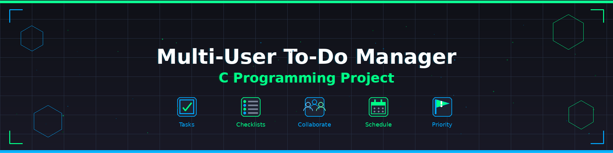

# Nimbus_Project_Sahil_28
Multi‑User To‑Do Manager in C | Task assignment, priority &amp; deadline sorting, dynamic arrays, search &amp; edit, productivity report, recurring tasks &amp; dependencies. Academic collaborative systems project.
